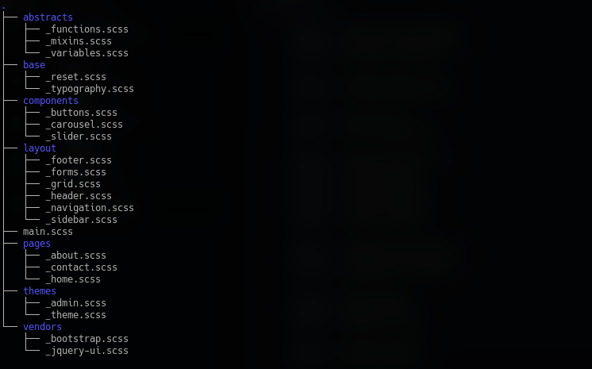

# Structure for Sass/Scss

This is just a basic structure for sass that can be used as reference.

Credits to [Timothy Robards: Structuring your Sass Projects](https://itnext.io/structuring-your-sass-projects-c8d41fa55ed4)